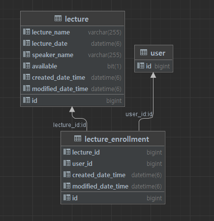
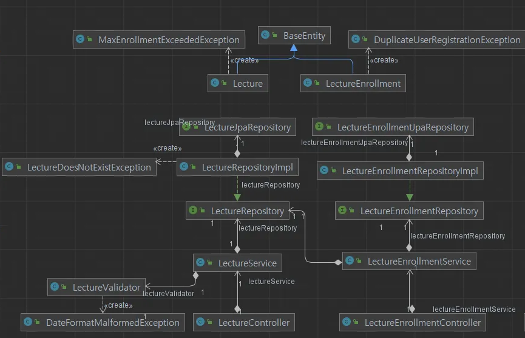

## ERD & 설명

### lecture : 강의에 대한 정보

    * id : 아이디
    * lecture_name : 강의를 사용자가 식별할 수 있는 강의명, 넉넉하게 varchar(255)
    * lecture_date : 강의가 열리는 시간, 상시 강의가 아닌 특강이기 때문에 같은 강의가 다른 시간에 열리는 것은 고려하지 않음
    * speaker_name : 강연자 명, 외국인 이름도 쓸 수 있도록 varchar(255)
    * available : 강의 수강인원이 모두 찼는지 아닌지를 판별하기 위함
    * created_date_time : 생성일자
    * modified_date_time : 수정일자

### lecture_enrollment : 강의 수강 신청에 대한 정보

    * id : 아이디
    * lecture_id : 수강신청의 대상이 되는 강의의 id
    * user_id : 수강을 신청한 사용자의 id
    * created_date_time : 생성일자
    * modified_date_time : 수정일자

* user : 사용자, 이번 과제에서는 존재한다고 가정하기 때문에 코드에 나타나지는 않지만 개념적으로 필요하다고 판단되어 ERD에 포함

* FK를 설정하지 않은 이유 : 강의가 삭제되어도 강의 신청 이력은 삭제되면 안된다고 판단

----

## 아키텍처 구조

* Lecture, LectureEnrollment 도메인에서 객체 생성, 업데이트 및 관련된 비즈니스 로직을 수행
* LectureRepository, LectureEnrollmentRepository를 추상화하여 DIP
* Repository 내부 구현 로직이 변경되더라도 Service, Domain에는 영향을 최소화 한다.

